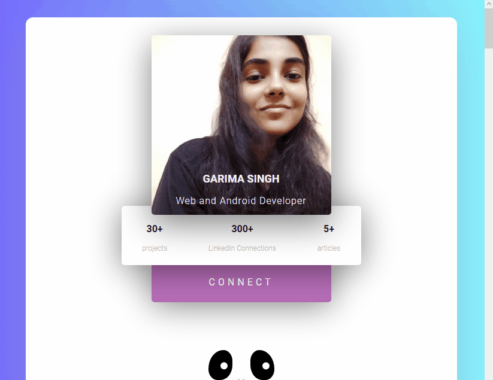

# garimasingh128.github.io

My portfolio in form of a website with the links to all my social media accounts, my working and completed projects and my Resume.
link: https://garimasingh128.github.io
link: bit.ly/garimasingh
